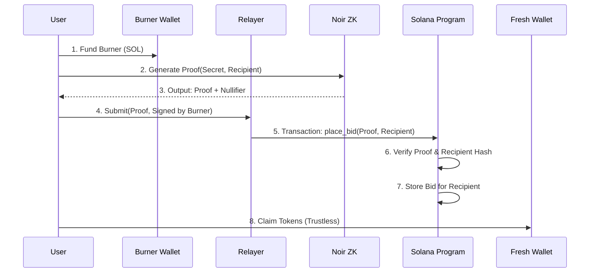

# 🌑 Darkpad: The Titan Release

> A bot-resistant, privacy-first token launchpad on Solana.

Darkpad leverages **Noir Zero-Knowledge Proofs** to decouple identity from participation, ensuring fair access and complete anonymity. The **Titan Release** introduces "Ghost Mode" relayers, Pro-Rata mechanics, and cryptographically bound ZK proofs.

  

## 🛡️ Titan Upgrade Features

### 1. Hardened Ghost Mode (Relayer Architecture)
-   **Security**: Implements **ZK Context Binding** (`Hash(Recipient)`) to prevent front-running and proof malleability.
-   **Anonymity**: Full support for relayed transactions, decoupling the **Payer** from the **Recipient**.
-   **On-Chain Verification**: [NEW] Noir ZK proofs are now verified directly on-chain via the Groth16 Verifier program.

### 2. Emergency Controls & Safe Math
-   **Emergency Pause**: Authority can pause critical instructions (`place_bid`, `reveal_bid`, `settle_auction`, `claim`) in case of logic flaws or malicious activity.
-   **u128 Math**: All settlement and claim logic utilizes `u128` precision to prevent arithmetic overflows and ensure insolvency safety.

### 3. Trustless Settlement
-   **Pro-Rata Allocation**: `(Bid * Supply) / TotalRaised`. Fair share distribution without gas wars.
-   **Accumulator Pattern**: On-chain math ensures the auction settles atomically without manual admin price injection.

---

## 🏗️ Architecture



## 📂 Project Structure

-   `programs/launchpad`: **Titan Logic**. The core auction smart contract.
-   `programs/shield`: **PrivacyCash**. The UTXO-based privacy pool.
-   `programs/verifier`: **Groth16 Verifier**. On-chain ZK verification.
-   `circuits/`: **Noir Circuits**. `main.nr` logic for whitelist eligibility.
-   `frontend/`: **Next.js App**. The "Ghost Mode" UI and Relayer client.
-   `sdk/`: **TypeScript SDK**. For deeper integration.

## 🚀 Getting Started

### Prerequisites
-   Rust & Cargo
-   Solana CLI `v1.18+`
-   Anchor `v0.30+`
-   Node.js `v20+`
-   Noir `nargo` (latest)

### 1. Build Circuits & Contracts
```bash
# Compile ZK Circuits
cd circuits/check_eligibility && nargo compile

# Build Solana Programs
anchor build
```

### 2. Run Tests
```bash
# Run comprehensive test suite
anchor test
```

### 3. Start Frontend
```bash
cd frontend
npm install
npm run dev
```

## 🔒 Security

This codebase has undergone a **Titan-Grade Audit** (Jan 2026).
-   **Proof Malleability**: Patched via Recipient Binding.
-   **Origin Leak**: Patched via Relayer Support.

## 📜 License

MIT License. Open Privacy for All.
